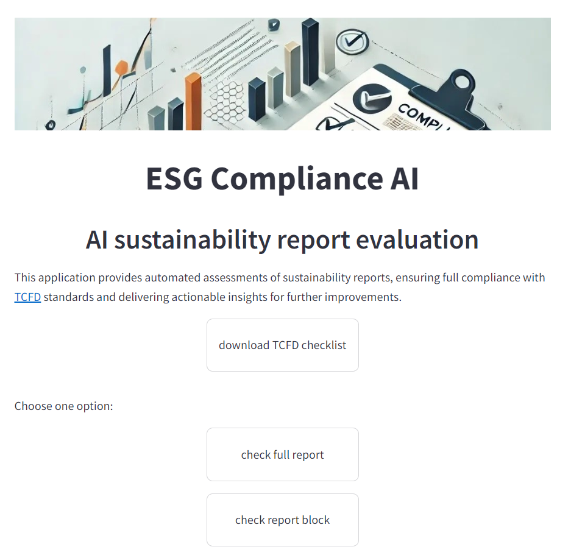

# ESG Compliance AI
## A project implemented as part of the HackAI event 2024.

**ESG Compliance AI** is an automated solution that uses LLM techniques to parse and understand the text in annual reports. The application helps assess the presence and quality of disclosures related to climate governance, strategy, risk management and metrics/targets as per TCFD recommendations. As result, it generates actionable insights and suggestions to enhance the reports, ensuring better compliance with TCFD guidelines.

The application utilizes the API connection of ChatGPT-4o, enhanced with prompt engineering and RAG techniques. The repository includes code for deploying the demo version of the application on the Streamlit service.

[Streamlit application](https://hackaiauditapper-mfbbaamy6tcjcvhyzbv488.streamlit.app/)
